# RuWork — Request and Data Flows

> **Part of the RuWork Developer Guide.**
> [Project Overview](00_RuWork_Project_Overview.md) · [Backend Guide](01_RuWork_Backend_Complete_Guide.md) · [Frontend Guide](02_RuWork_Frontend_Complete_Guide.md) · [Code Glossary](03_RuWork_Code_Glossary.md)

Eighteen end-to-end flows. Each shows the exact files and functions involved, so you can follow any feature from a click in the browser to a document in MongoDB.

Diagrams are given as Mermaid (rendered by GitHub/VS Code) with a plain-text version underneath for terminals and printouts.

---

## Contents

| # | Flow | # | Flow |
|---|---|---|---|
| 1 | [Student registration](#1-student-registration) | 10 | [Application completion](#10-application-completion) |
| 2 | [Provider registration](#2-provider-registration) | 11 | [Review creation](#11-review-creation) |
| 3 | [Email verification](#3-email-verification) | 12 | [Message sending](#12-message-sending) |
| 4 | [Admin approval](#4-admin-approval) | 13 | [Notification creation](#13-notification-creation) |
| 5 | [Login](#5-login) | 14 | [Admin job moderation](#14-admin-job-moderation) |
| 6 | [Job creation and publishing](#6-job-creation-and-publishing) | 15 | [Admin review moderation](#15-admin-review-moderation) |
| 7 | [Job search](#7-job-search) | 16 | [Password change](#16-password-change) |
| 8 | [Application creation](#8-application-creation) | 17 | [Forgot / reset password](#17-forgot--reset-password) |
| 9 | [Application acceptance](#9-application-acceptance) | 18 | [Logout / token revocation](#18-logout--token-revocation) |

**The universal middleware prefix.** Every backend request first passes `securityHeaders → corsPolicy → express.json → requireObjectBody → apiRateLimiter` in `index.js`. It is omitted from each diagram to keep them readable.

---

## 1. Student registration

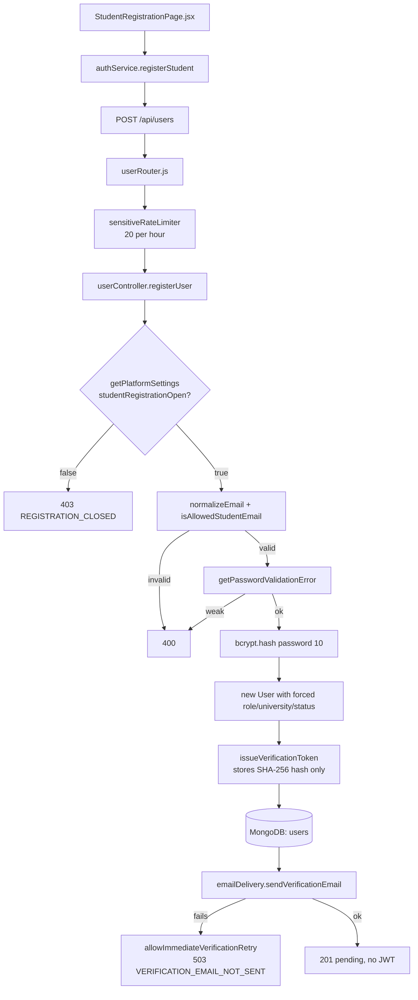

```text
StudentRegistrationPage → authService.registerStudent → POST /api/users
  → userRouter → sensitiveRateLimiter → registerUser()
     → settings gate → email domain → password strength
     → bcrypt.hash → new User(explicit fields only) → issueVerificationToken
     → save → sendVerificationEmail → 201 (no JWT)
```

| Layer | File → function |
|---|---|
| Page | `pages/auth/StudentRegistrationPage.jsx` |
| Service | `services/authService.js` → `registerStudent()` |
| Router | `routes/userRouter.js` |
| Middleware | `middlewears/security.js` → `sensitiveRateLimiter` |
| Controller | `controllers/userController.js` → `registerUser()` |
| Utils | `utils/admin.js` → `getPlatformSettings()`; `utils/account.js` → `normalizeEmail`, `isAllowedStudentEmail`, `getPasswordValidationError`; `utils/emailVerification.js` → `issueVerificationToken()`; `utils/emailService.js` → `emailDelivery` |
| Model | `models/user.js` |

**Key points.** The document is built field by field — never `new User(req.body)` — so `role`, `university`, `accountStatus`, and `isEmailVerified` cannot be supplied by the client. No JWT is returned: registration is not authentication.

---

## 2. Provider registration

Identical shape, four differences.

```text
ProviderRegistrationPage → authService.registerJobProvider → POST /api/jobProviders
  → jobProviderRouter → sensitiveRateLimiter → registerJobProvider()
     → providerRegistrationOpen gate
     → hasBasicEmailFormat(companyEmail)      ← NOT domain-restricted
     → password strength → bcrypt.hash
     → new JobProvider(company + contact fields, role forced to Job_Provider)
     → issueVerificationToken → save → email → 201
```

| Difference | Student | Provider |
|---|---|---|
| Email rule | Exactly `ruh.ac.lk` | Any valid address |
| Email field | `email` | `companyEmail` |
| Settings gate | `studentRegistrationOpen` | `providerRegistrationOpen` |
| Extra data | Academic fields | Company name, address, size, industry, website, description |

---

## 3. Email verification

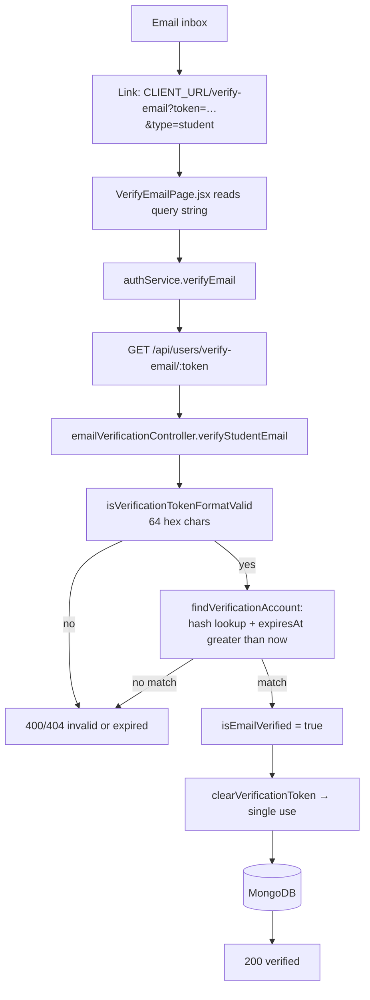

```text
Inbox link → VerifyEmailPage (reads ?token & ?type)
  → authService.verifyEmail → GET /api/users/verify-email/:token
  → verifyStudentEmail() → format check → SHA-256 hash lookup with expiry IN the query
  → isEmailVerified = true → clearVerificationToken → 200
```

| Layer | File → function |
|---|---|
| Page | `pages/auth/VerifyEmailPage.jsx` |
| Service | `services/authService.js` → `verifyEmail()` |
| Router | `routes/userRouter.js` / `routes/jobProviderRouter.js` |
| Controller | `controllers/emailVerificationController.js` → `verifyStudentEmail` / `verifyJobProviderEmail` |
| Utils | `utils/emailVerification.js` → `findVerificationAccount`, `clearVerificationToken` |

**Key points.** The link points at the **frontend**, which then calls the API. Only the hash is stored. Expiry is enforced *inside* the query, so it cannot be forgotten. Clearing the hash makes the link single-use. `accountStatus` is deliberately unchanged — approval is separate.

**Resend:** `POST /api/users/resend-verification` → `resendStudentVerification()` → `getVerificationResendWaitSeconds()` enforces a persisted 60-second cooldown and issues a fresh token, invalidating the previous one.

---

## 4. Admin approval

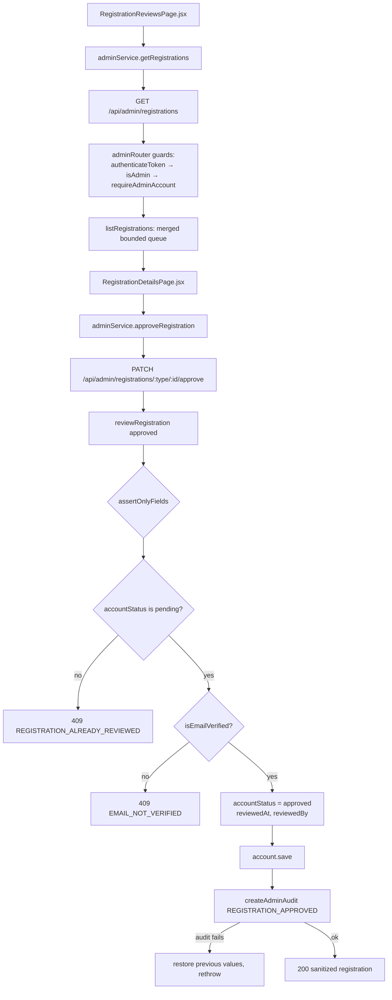

```text
RegistrationReviewsPage → adminService.getRegistrations → GET /api/admin/registrations
  → [authenticateToken → isAdmin → requireAdminAccount] → listRegistrations()
RegistrationDetailsPage → adminService.approveRegistration
  → PATCH /api/admin/registrations/:type/:id/approve → reviewRegistration()
     → allowlist body → must be pending → must be verified
     → save → createAdminAudit → 200
```

| Layer | File → function |
|---|---|
| Pages | `pages/admin/RegistrationReviewsPage.jsx`, `RegistrationDetailsPage.jsx` |
| Service | `services/adminService.js` → `getRegistrations`, `approveRegistration`, `rejectRegistration` |
| Controller | `controllers/adminController.js` → `listRegistrations`, `getRegistration`, `approveRegistration`, `rejectRegistration` |
| Utils | `utils/admin.js` → `assertOnlyFields`, `adminPagination`, `createAdminAudit` |

**Key points.** Approval requires prior email verification. Repeating a decision returns `409`. Rejection accepts a trimmed reason ≤500 characters. If the audit write fails, the status change is **rolled back** — an unaudited admin action must not exist.

---

## 5. Login

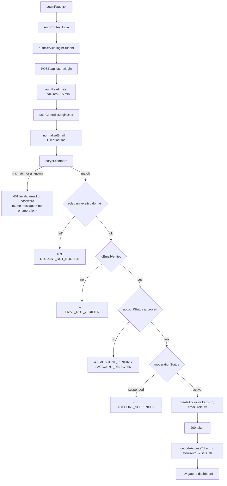

```text
LoginPage → AuthContext.login → authService.loginStudent → POST /api/users/login
  → authRateLimiter → loginUser()
     → normalizeEmail → findOne → bcrypt.compare
     → eligibility → verified → approved → not suspended
     → createAccessToken → 200 { token }
  → decodeAccessToken → storeAuth (sessionStorage) → setAuth → navigate
```

| Layer | File → function |
|---|---|
| Page | `pages/auth/LoginPage.jsx` |
| Context | `context/AuthContext.jsx` → `login()` |
| Service | `services/authService.js` → `loginStudent` / `loginJobProvider` / `loginAdmin` |
| Controller | `controllers/userController.js` → `loginUser()` |
| Utils | `utils/account.js` → `normalizeEmail`, `createAccessToken` |
| Frontend utils | `utils/token.js` → `decodeAccessToken`; `utils/authStorage.js` → `storeAuth` |

**Key points.** One generic message for a wrong email *or* wrong password prevents enumeration; the later messages are specific because the password has already proven ownership. The rate limiter counts only failures. Specific codes (`EMAIL_NOT_VERIFIED`, `ACCOUNT_PENDING`, `ACCOUNT_REJECTED`) route the user to dedicated account-state pages.

---

## 6. Job creation and publishing

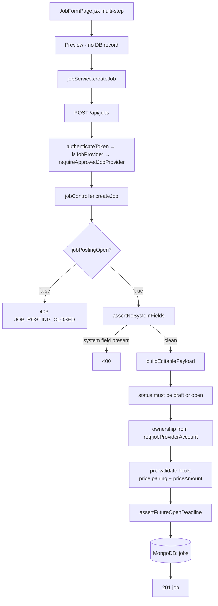

```text
JobFormPage (Basics → Skills → Work Details → Pricing → Description → Preview)
  → jobService.createJob → POST /api/jobs
  → [authenticateToken → isJobProvider → requireApprovedJobProvider]
  → createJob() → settings gate → assertNoSystemFields → editable payload only
     → ownership from the authenticated provider → pricing hook → deadline check
     → save → 201
```

| Layer | File → function |
|---|---|
| Page | `pages/provider/JobFormPage.jsx`, `components/jobs/JobPreview.jsx` |
| Service | `services/jobService.js` → `createJob`, `updateJob` |
| Controller | `controllers/jobController.js` → `createJob`, `updateJob`, `deleteJob` |
| Utils | `utils/job.js` → `JOB_CATEGORIES`, `normalizeSkills` |
| Model | `models/job.js` (pre-validate pricing hook) |

**Key points.** Preview creates nothing — it renders the same component the public page uses. `assertNoSystemFields` blocks all fourteen server-owned fields on both create and update, so a provider cannot un-hide a moderated job by editing it. Ownership always comes from `req.jobProviderAccount._id`.

**Publish / close / reopen** go through `PATCH /api/jobs/:id` with a validated status transition. **Archive** is `DELETE /api/jobs/:id` → sets `status: "closed"` and `archivedAt: now` — never an erase.

---

## 7. Job search

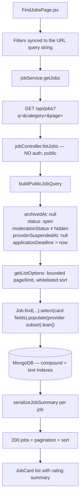

```text
FindJobsPage (URL-synced filters) → jobService.getJobs → GET /api/jobs?…
  → listJobs() → buildPublicJobQuery() (five conditions)
     → bounded pagination + whitelisted sort
     → find + select + populate(limited fields) + lean
     → serializeJobSummary → 200
```

| Layer | File → function |
|---|---|
| Page | `pages/jobs/FindJobsPage.jsx`, `components/jobs/JobCard.jsx` |
| Service | `services/jobService.js` → `getJobs` |
| Controller | `controllers/jobController.js` → `listJobs`, `buildPublicJobQuery`, `getListOptions`, `serializeJobSummary` |
| Utils | `utils/job.js` → `escapeRegex`, `escapeSearchText` |

**Key points.** All five visibility conditions must hold. Sorts are whitelisted (`newest`, `oldest`, `price-low`, `price-high`, `rating`) so a caller cannot force an unindexed scan or sort by a hidden internal field. Location and skill filters are regex-escaped. Cards carry only `averageRating` and `reviewCount` — never individual comments, which load separately on Job Details.

---

## 8. Application creation

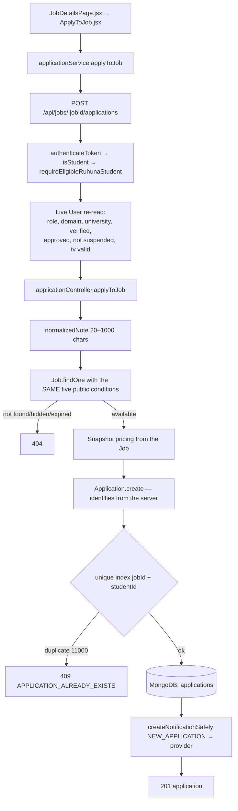

```text
JobDetailsPage → ApplyToJob → applicationService.applyToJob
  → POST /api/jobs/:jobId/applications          ← note: on the JOB router
  → [authenticateToken → isStudent → requireEligibleRuhunaStudent]
  → applyToJob() → note validation → job availability re-check
     → pricing snapshot → create (unique index guards duplicates)
     → notify provider (best-effort) → 201
```

| Layer | File → function |
|---|---|
| Page | `pages/jobs/JobDetailsPage.jsx`, `components/applications/ApplyToJob.jsx` |
| Service | `services/applicationService.js` → `applyToJob` |
| Router | `routes/jobRouter.js` |
| Controller | `controllers/applicationController.js` → `applyToJob` |
| Utils | `utils/application.js` → `normalizedNote`; `utils/communication.js` → `createNotificationSafely` |

> ⚠️ **Endpoint note:** creation lives on the **Job** router, not `/api/applications`. `PROJECT_PLAN.md` describes it imprecisely — see [Overview §11.1](00_RuWork_Project_Overview.md#11-known-discrepancies-between-the-plan-and-the-code).

**Key points.** Job availability is re-checked with the same five conditions used by public browse — defence in depth. The pricing snapshot is immutable, so later job edits cannot rewrite history. The unique index, not the controller check, is the real duplicate guarantee.

---

## 9. Application acceptance

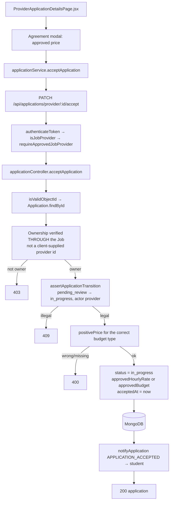

```text
ProviderApplicationDetailsPage → applicationService.acceptApplication
  → PATCH /api/applications/provider/:id/accept
  → [authenticateToken → isJobProvider → requireApprovedJobProvider]
  → acceptApplication() → ownership through the Job → transition table
     → approved price for the budget type → save → notify student → 200
```

| Layer | File → function |
|---|---|
| Page | `pages/provider/ProviderApplicationDetailsPage.jsx`, `components/applications/ProviderApplicationActions.jsx` |
| Service | `services/applicationService.js` → `acceptApplication`, `declineApplication`, `completeApplication` |
| Controller | `controllers/applicationController.js` → `acceptApplication` |
| Utils | `utils/application.js` → `assertApplicationTransition`, `positivePrice` |

**Key points.** Ownership is derived from the related Job, never from the request. The transition table encodes *who* may make *which* move. The schema hook then re-validates that an accepted application really has the right approved price.

---

## 10. Application completion

```text
ProviderApplicationDetailsPage → applicationService.completeApplication
  → PATCH /api/applications/provider/:id/complete
  → [authenticateToken → isJobProvider → requireApprovedJobProvider]
  → completeApplication()
     → ownership through the Job
     → assertApplicationTransition(in_progress → completed, "provider")
     → status = completed, completedAt = now → save
     → notifyApplication(APPLICATION_COMPLETED → student)
     → 200
```

**Why this step matters beyond bookkeeping:** `completed` is the **only** status that unlocks reviewing. The whole review system hangs off this transition.

**The student-side terminal moves:**

| Action | Endpoint | Allowed from | Result |
|---|---|---|---|
| Withdraw | `PATCH /api/applications/my/:id/withdraw` | `pending_review` | `withdrawn` + notify provider |
| Cancel | `PATCH /api/applications/my/:id/cancel` | `in_progress` | `cancelled` (+ optional reason) + notify provider |

`withdrawn`, `declined`, `completed`, and `cancelled` are all terminal — nothing moves out of them.

---

## 11. Review creation

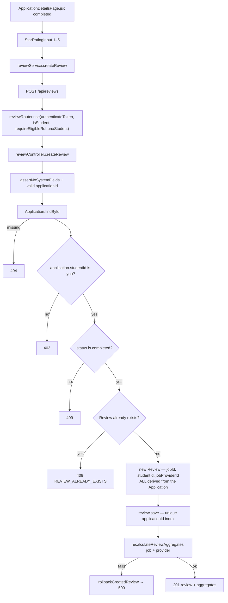

```text
ApplicationDetailsPage (completed only) → reviewService.createReview → POST /api/reviews
  → [authenticateToken → isStudent → requireEligibleRuhunaStudent]
  → createReview() → own application? → completed? → not already reviewed?
     → identities derived from the Application (never the client)
     → save → recalculateReviewAggregates → 201
```

| Layer | File → function |
|---|---|
| Page | `pages/student/ApplicationDetailsPage.jsx`, `components/reviews/StarRatingInput.jsx`, `StudentReviewActions.jsx` |
| Service | `services/reviewService.js` → `createReview`, `deleteMyReview` |
| Controller | `controllers/reviewController.js` → `createReview` |
| Utils | `utils/review.js` → `reviewRating`, `reviewComment`; `utils/ratingAggregates.js` → `recalculateReviewAggregates` |

**Key points.** The client sends only `applicationId`, `rating`, and `comment` — every identity is derived server-side, so you cannot review a provider you never worked with. If aggregate recalculation fails, the review is rolled back rather than leaving inconsistent ratings.

---

## 12. Message sending

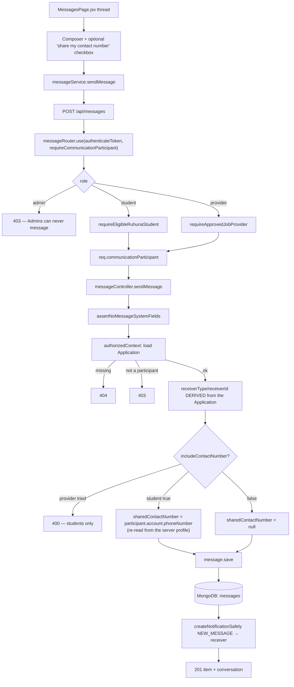

```text
MessagesPage → messageService.sendMessage → POST /api/messages
  → [authenticateToken → requireCommunicationParticipant]   ← Admin rejected here
  → sendMessage() → authorizedContext(applicationId, participant)
     → receiver computed from the Application (never chosen by the client)
     → contact number read from the authenticated profile, students only
     → save → notify receiver → 201
```

| Layer | File → function |
|---|---|
| Page | `pages/messages/MessagesPage.jsx` |
| Service | `services/messageService.js` → `sendMessage`, `getConversation`, `getConversations` |
| Middleware | `middlewears/authMiddleware.js` → `requireCommunicationParticipant` |
| Controller | `controllers/messageController.js` → `sendMessage` |
| Utils | `utils/communication.js` → `messageContent`, `createNotificationSafely` |

**Key points.** The recipient cannot be chosen — it is computed from the Application, so RuWork can never be used to message an arbitrary account. The shared contact number comes from the server's copy of the student's profile, never from the request body. Admins have no branch in the guard, so private conversations stay private.

---

## 13. Notification creation

Notifications are always a **side effect** of a completed action, never a standalone request.

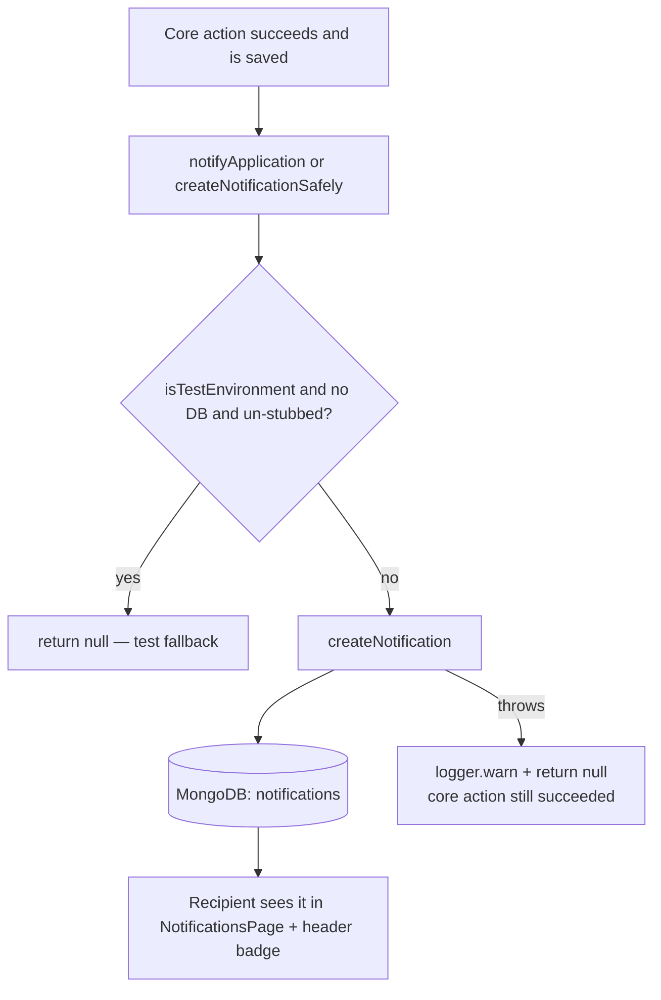

```text
Application/Message saved successfully
  → createNotificationSafely({ recipientType, recipientId, type, message, related ids })
     → success → notification stored
     → failure → logged and swallowed (best-effort)
```

**The seven triggers:**

| Type | Fired by | Recipient |
|---|---|---|
| `NEW_APPLICATION` | `applyToJob` | Provider |
| `APPLICATION_ACCEPTED` | `acceptApplication` | Student |
| `APPLICATION_DECLINED` | `declineApplication` | Student |
| `APPLICATION_WITHDRAWN` | `withdrawMyApplication` | Provider |
| `APPLICATION_CANCELLED` | `cancelMyApplication` | Provider |
| `APPLICATION_COMPLETED` | `completeApplication` | Student |
| `NEW_MESSAGE` | `sendMessage` | Receiver |

**Reading them:** `GET /api/notifications` (paginated, unread filter), `PATCH /api/notifications/:id/read`, `PATCH /api/notifications/read-all`, `GET /api/notifications/unread-count`. Every operation is recipient-scoped, so you cannot read or mark someone else's.

**Why best-effort:** the application is the system of record; the notification is a convenience. Failing the whole request because a notification could not be written would tell the student their application failed when it had actually been created.

---

## 14. Admin job moderation

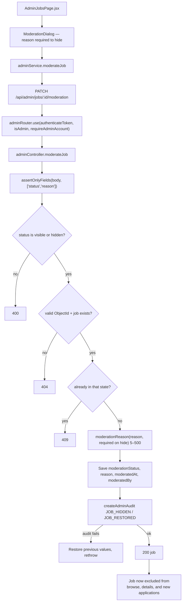

```text
AdminJobsPage → ModerationDialog → adminService.moderateJob
  → PATCH /api/admin/jobs/:id/moderation
  → [authenticateToken → isAdmin → requireAdminAccount]
  → moderateJob() → allowlist → status enum → 404 → 409 if unchanged
     → reason required on hide → save → createAdminAudit
     → on audit failure: roll back → 200
```

| Layer | File → function |
|---|---|
| Pages | `pages/admin/AdminJobsPage.jsx`, `AdminJobDetailsPage.jsx`, `components/admin/ModerationDialog.jsx` |
| Service | `services/adminService.js` → `moderateJob` |
| Controller | `controllers/adminController.js` → `moderateJob` |
| Utils | `utils/admin.js` → `assertOnlyFields`, `moderationReason`, `createAdminAudit` |

**Key points.** Fully reversible — nothing is deleted, and applications, messages, and reviews survive. The provider cannot undo it: all moderation fields are system fields, so editing, publishing, or reopening the job cannot clear the hide.

**Provider suspension** is the related flow: `PATCH /api/admin/providers/:id/moderation` additionally runs `Job.updateMany({ jobProviderId }, { $set: { providerSuspendedAt } })`, hiding every owned job at once — and the cascade is reversed too if the audit write fails.

---

## 15. Admin review moderation

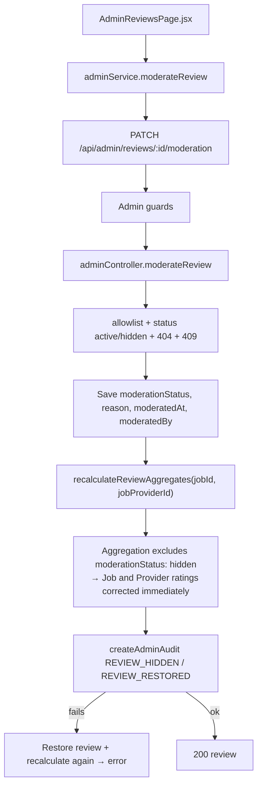

```text
AdminReviewsPage → adminService.moderateReview → PATCH /api/admin/reviews/:id/moderation
  → Admin guards → moderateReview()
     → save status → recalculateReviewAggregates (hidden reviews excluded)
     → createAdminAudit → 200
```

**Key points.** The recalculation is what makes hiding *meaningful* — `averageRating` is a stored copy, so without it a hidden review would keep dragging the score down. The aggregation's `moderationStatus: { $ne: "hidden" }` filter is the single line that ties moderation to ratings.

`DELETE /api/admin/reviews/:id` remains for content that must not persist at all; it writes a `REVIEW_DELETED` audit and recalculates too.

---

## 16. Password change

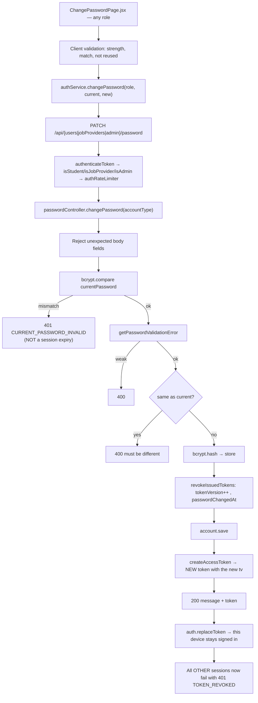

```text
ChangePasswordPage → authService.changePassword → PATCH /api/…/password
  → [authenticateToken → role guard → authRateLimiter]
  → changePassword(accountType)
     → verify current → strength → reject reuse → hash
     → tokenVersion++ (kills every issued token)
     → return ONE fresh token → frontend replaceToken()
```

| Layer | File → function |
|---|---|
| Page | `pages/auth/ChangePasswordPage.jsx` |
| Service | `services/authService.js` → `changePassword` |
| Context | `context/AuthContext.jsx` → `replaceToken` |
| Controller | `controllers/passwordController.js` → `changePassword` |
| Utils | `utils/password.js` → `revokeIssuedTokens`; `utils/account.js` → `getPasswordValidationError`, `createAccessToken` |

**Key points.** The fresh token is why the acting device is not signed out by its own success. The `401 CURRENT_PASSWORD_INVALID` code is deliberately excluded from the Axios interceptor's session-clearing rule — a typo must not log you out ([Frontend §5](02_RuWork_Frontend_Complete_Guide.md#5-axios-and-the-shared-api-client)).

---

## 17. Forgot / reset password

### Part A — request the link

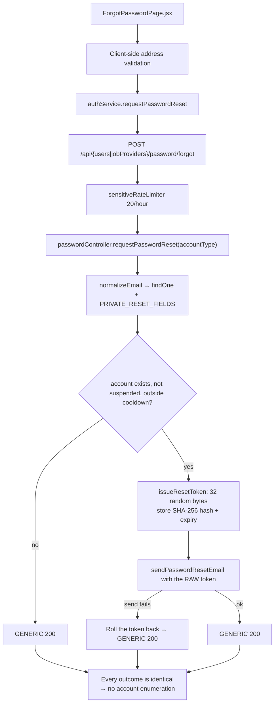

### Part B — complete the reset

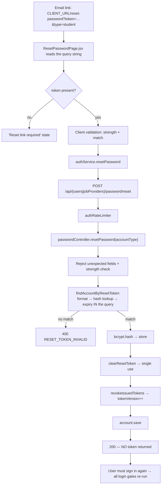

```text
A: ForgotPasswordPage → POST /…/password/forgot → generic 200 in every case
B: Email link → ResetPasswordPage → POST /…/password/reset
     → hashed single-use token, expiry in the query
     → new hash → clear token → tokenVersion++ → 200 (no token)
```

| Layer | File → function |
|---|---|
| Pages | `pages/auth/ForgotPasswordPage.jsx`, `ResetPasswordPage.jsx` |
| Service | `services/authService.js` → `requestPasswordReset`, `resetPassword` |
| Controller | `controllers/passwordController.js` → `requestPasswordReset`, `resetPassword` |
| Utils | `utils/password.js` → `issueResetToken`, `findAccountByResetToken`, `clearResetToken`, `revokeIssuedTokens`; `utils/emailService.js` → `sendPasswordResetEmail` |

**Key points.** One generic response for every forgot-password outcome blocks enumeration. Only the token hash is stored, expiry is enforced inside the query, and the token is consumed on use. No access token is returned — the user re-enters the full login path, so a suspended or rejected account cannot be revived through a reset.

> **Admins have no reset path.** Only change and logout. If an Admin's mailbox were compromised, an email-based reset would hand over the whole platform.

---

## 18. Logout / token revocation

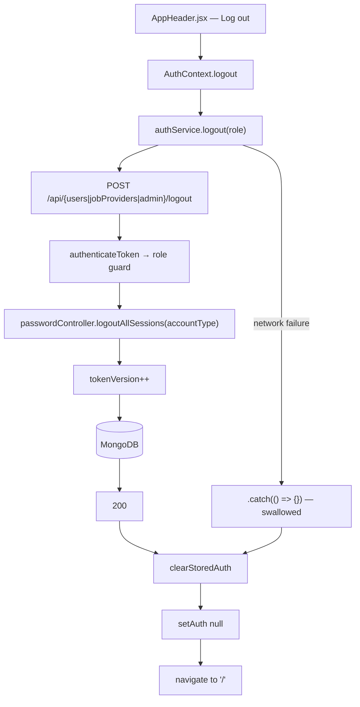

### What happens to a token afterwards

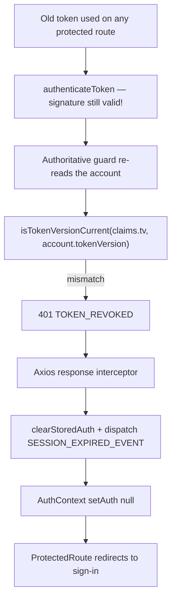

```text
Log out → authService.logout → POST /…/logout → tokenVersion++
       → clearStoredAuth + setAuth(null)   (runs even if the request failed)

Any later request with the old token:
  signature valid → guard re-reads account → tv mismatch → 401 TOKEN_REVOKED
  → Axios interceptor clears the session → ProtectedRoute redirects
```

| Layer | File → function |
|---|---|
| Component | `components/layout/AppHeader.jsx` → `logout()` |
| Context | `context/AuthContext.jsx` → `logout` |
| Service | `services/authService.js` → `logout` |
| Controller | `controllers/passwordController.js` → `logoutAllSessions` |
| Middleware | `middlewears/authMiddleware.js` → `isTokenVersionCurrent` check in all three guards |
| Frontend | `services/api.js` → response interceptor, `SESSION_EXPIRED_EVENT` |

**Key points.** Clearing `sessionStorage` alone would only remove *this browser's copy* — the token would stay valid until expiry. Incrementing `tokenVersion` is what actually kills it. Local state is cleared regardless of whether the server call succeeded, so a network failure cannot leave someone apparently signed in.

**Revocation is enforced at the guard**, so a revoked token is rejected on its *next* request rather than instantly at the network edge — a documented, accepted trade-off that costs zero extra database queries.

---

## Quick endpoint reference

Verified against the routers in `RuWork_backend-master/routes/`.

### Public
| Method | Path | Purpose |
|---|---|---|
| GET | `/api/health` | Liveness/readiness |
| GET | `/api/jobs` | Browse/search |
| GET | `/api/jobs/:id` | Job details |
| GET | `/api/jobs/:jobId/reviews` | Paginated job reviews |

### Students — `/api/users`
| Method | Path |
|---|---|
| POST | `/` (register) · `/login` · `/resend-verification` · `/password/forgot` · `/password/reset` · `/logout` |
| GET | `/verify-email/:token` · `/profile` · `/dashboard` · `/job-history` |
| PATCH | `/profile` · `/password` |

### Providers — `/api/jobProviders`
| Method | Path |
|---|---|
| POST | `/` (register) · `/login` · `/resend-verification` · `/password/forgot` · `/password/reset` · `/logout` |
| GET | `/verify-email/:token` · `/profile` · `/dashboard` · `/reviews` |
| PATCH | `/profile` · `/password` |

### Jobs — `/api/jobs` (provider-scoped)
| Method | Path |
|---|---|
| POST | `/` (create) · `/:jobId/applications` (**student applies**) |
| GET | `/my` · `/my/:id` · `/:jobId/applications` (provider's applicants) |
| PATCH | `/:id` |
| DELETE | `/:id` (archives) |

### Applications — `/api/applications`
| Method | Path |
|---|---|
| GET | `/my` · `/my/job/:jobId` · `/my/:id` · `/provider/:id` |
| PATCH | `/my/:id/withdraw` · `/my/:id/cancel` · `/provider/:id/accept` · `/provider/:id/decline` · `/provider/:id/complete` |

### Reviews — `/api/reviews` (student only)
| Method | Path |
|---|---|
| POST | `/` |
| GET | `/my/application/:applicationId` |
| DELETE | `/:id` |

### Messages — `/api/messages` · Notifications — `/api/notifications`
| Method | Path |
|---|---|
| GET | `/messages/unread-count` · `/messages/conversations` · `/messages/conversations/:applicationId` |
| POST | `/messages` |
| GET | `/notifications` · `/notifications/unread-count` |
| PATCH | `/notifications/read-all` · `/notifications/:id/read` |

### Admin — `/api/admin`
| Method | Path |
|---|---|
| POST | `/login` (public) · `/logout` |
| PATCH | `/password` |
| GET | `/dashboard` · `/registrations` · `/registrations/:type/:id` · `/students` · `/students/:id` · `/providers` · `/providers/:id` · `/jobs` · `/jobs/:id` · `/reviews` · `/reviews/:id` · `/settings` · `/audits` |
| PATCH | `/registrations/:type/:id/approve` · `/registrations/:type/:id/reject` · `/students/:id/moderation` · `/providers/:id/moderation` · `/jobs/:id/moderation` · `/reviews/:id/moderation` · `/settings` |
| DELETE | `/reviews/:id` |

---

**Back to:** [Project Overview](00_RuWork_Project_Overview.md) · [Backend Guide](01_RuWork_Backend_Complete_Guide.md) · [Frontend Guide](02_RuWork_Frontend_Complete_Guide.md) · [Code Glossary](03_RuWork_Code_Glossary.md)
